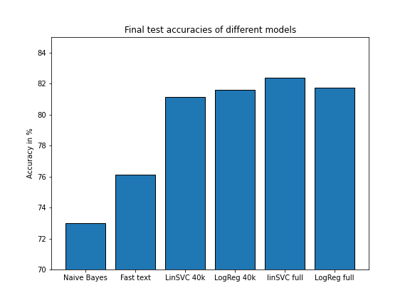

***
# Category Analysis

In this working directory we will analyze categories and their corresponding text contents, and train a model to predict categories of new articles by their content.

## Table of Contents
1. [Data Procurement and Cleaning](#Data-Procurement-and-Cleaning)
2. [EDA](#EDA)
3. [Modelling](#Modeling)
4. [Feature Engineering](#Feature-Engineering)
5. [Results](#Results)
6. [Word Map](#Word-Map)

## Data Procurement and Cleaning
The data consists of about 500000 articles from [webhose.io](https://webhose.io/free-datasets/). The article distribution over the categories is not balanced. The dataset is only from 2015.

The data cleaning can be found in [this notebook](../Datasets/dataset_categories/datacleaning.ipynb).

The features of the data are checked, unnecessary ones are deleted. The titles and texts are checked for errors, unnecessary contents and other stuff that does not belong into article texts.

The articles are from different website sources. These are also highly unbalanced, so they are also balanced out.

Afterwards the texts are lemmatized and numbers etc are removed. The operations can be looked up in [this file](../Functions/test_lemmatization.py).

The data is separated into train and test data and saved to csvs.

## EDA
We look at the data in more detail in [this notebook](eda.ipynb).

Here the different publishers are investigated and we try to balance them out, to get a more variable dataset.

The categories are classified by our model and the results are investigated for the different categories. Here we will see, that espacially world and politics are hard to separate.

We look at the most important words in every category.

Also we use word2vec from Gensim to create own word embeddings for further modelling.

## Modeling
We try out different models like SVMs and Logistic Regression or Ensemble methods implemented in scikit-learn in [this notebook](models_scikit.ipynb). Espacially linear SVM and Logistic Regression give quite good results, but still show an overfit, that can not be removed by regularization.

Also we try out a simple fully connected neural network, and a bidirectional LSTM in [this notebook](models_tf.ipynb). Both models highly overfit, either because they are too complex for the problem, or the dataset still shows inconsistencies.

We also shortly tried out Fast text in [this notebook](fast_text/fast_text.ipynb). Fast text is a text categorizer from Facebook. It gives us a result of about 76 % accuracy, so it's worse then our models.

## Feature Engineering
In [this notebook](feature_engineering.ipynb) different bags of words and word embeddings are tested, to get the best features for categorization. The best model for our problem is the TFIDF-Vectorizer from sklearn.

## Results
Our models are finalized in [this notebook](models_scikit_hyperOpt.ipynb).

Below we see the final results for our models on the test dataset. If we take the Naive Bayes as our Base model, we see that the Fast text categorizer already improves the result by about 4%. With Logistic Regression and Linear SVC we were able to improve our Accuracy to about 82%. The best final model is the linear SVC, but you have to take into account about 900k feature words to achieve this accuracy. If we reduce the feature size to 40k, we still achieve an accuracy of almost 82% with logistic Regression, that's why we will use this cheaper method instead.

## Word Map

Finally, we tried to visualize how words can be respresented in different categories in the text. Below is a small simulation showing word dependencies. If you want to know more about it, checkout [here](word_map/README.md).

