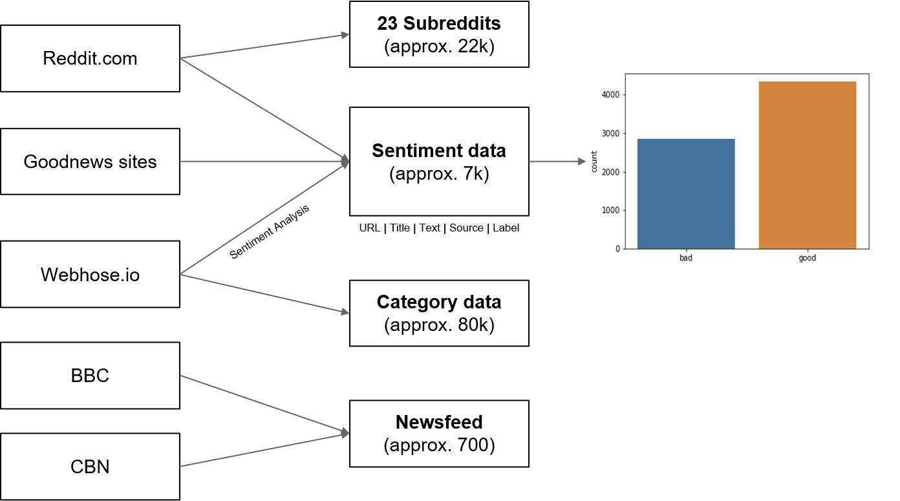

This folder contains all the datasets we worked with
Most of them contain a "raw" and a clean version + the scraping and cleaning notebooks

- dataset_categories : contains only the functions we used to process the webhose.io dataset (far too big to upload on git)
- dataset_reddit : ~4k articles found through reddit. We used 4 subreddits (2 for good and 2 for bad news) and scraped all the linked articles to combine.
- good_news_network, the_journal and positive_news : articles scraped from the respective website

- twitter_good_bad : REMOVE?

- put_all_together : notebook in which we combined all the articles with sentiments to one dataset
