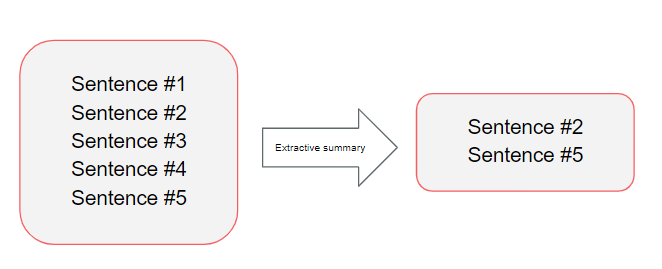

# Summarization 

Here you can find everything about the text summary to summarize the news articles later.

The main work can be found in the *"Text-Summarization-spaCy"* notebook. The functions are called via *"sum_functions"* to make the notebook more clearly arranged. 
The notebook *"Summarization_BERT"* was used to try out [BERT](https://towardsdatascience.com/bert-explained-state-of-the-art-language-model-for-nlp-f8b21a9b6270) (NLP model from Google for pre-training) and to be able to use it later if necessary, as long as work on this project continues. 
